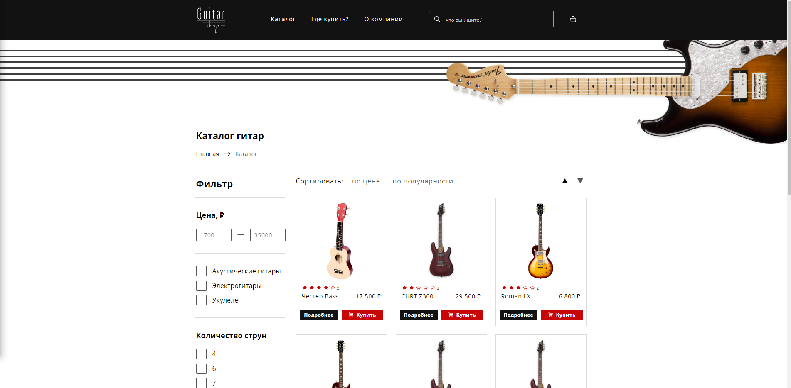

# Что это

Выполненный мной проект Акселератора HTML Academy
_________________________________________________

Рабочие страницы:

Каталог, Страница гитары, Корзина
_________________________________________________

В разработке использованы:

react, redux, redux-toolkit, jest, testing-library ... 
_________________________________________________

Деплой на vercel

https://guitars-golik.vercel.app/catalog
_________________________________________________

Серверная часть создана HTML Academy:

https://accelerator-guitar-shop-api-v1.glitch.me
<a href="https://guitars-golik.vercel.app/catalog">
  
</a>


# Руководство по работе с проектом

### Запуск проекта

```bash
npm start
```


### Запуск тестов

```bash
npm test
```


### Проверка линтером

```bash
npm run eslint
```


### Сборка проекта

```bash
npm run build
```


### Извлечение конфигурации проекта

```bash
npm run eject
```
